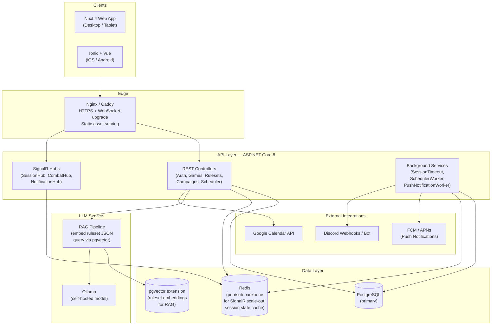
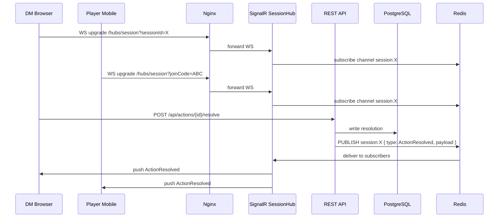
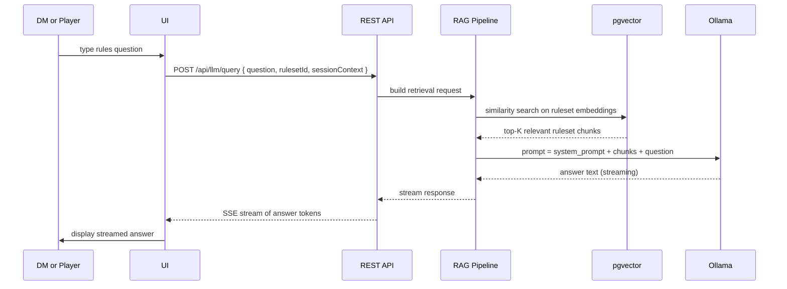
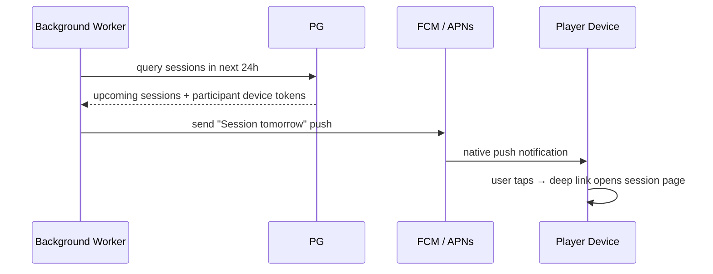
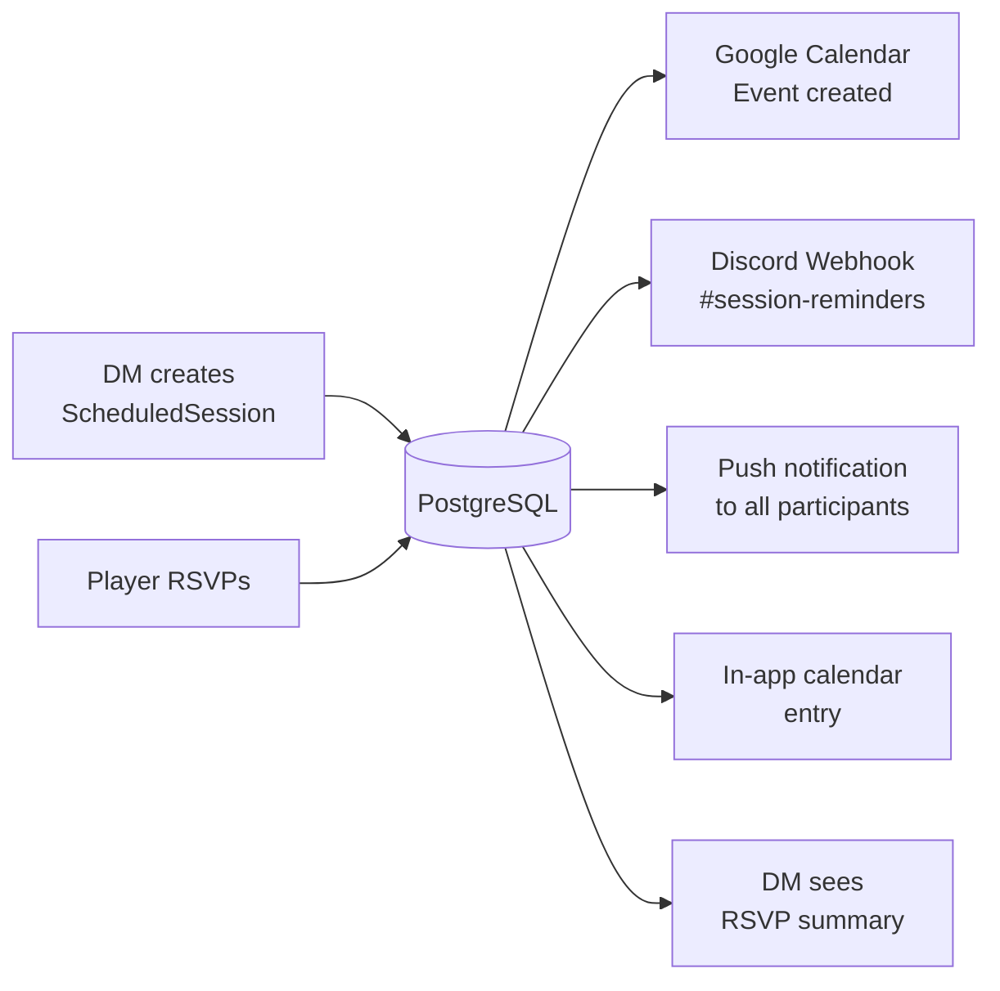

# TTRPG Table — v2.0 Design Document

**Status:** Draft  
**Date:** May 2026  
**Scope:** Architecture, feature design, UI/UX, and mobile strategy for the v2.0 platform

---

## Table of Contents

1. [Goals & Guiding Principles](#1-goals--guiding-principles)
2. [System Architecture](#2-system-architecture)
3. [Data Flow Diagrams](#3-data-flow-diagrams)
4. [Backend Changes](#4-backend-changes)
5. [New Feature Designs](#5-new-feature-designs)
   - 5a. Campaign Management
   - 5b. Session Scheduler
   - 5c. Game-Aware LLM Assistant
6. [Web Frontend (Nuxt 4)](#6-web-frontend-nuxt-4)
7. [Mobile Frontend (Ionic + Vue)](#7-mobile-frontend-ionic--vue)
8. [UI/UX Design System](#8-uiux-design-system)
9. [Infrastructure & Deployment](#9-infrastructure--deployment)
10. [Migration Path from v1.0](#10-migration-path-from-v10)
11. [Open Questions & Future Scope](#11-open-questions--future-scope)

---

## 1. Goals & Guiding Principles

### v2.0 Goals
- Replace polling with WebSocket real-time; eliminate the 3s round-trip lag
- Graduate from SQLite to PostgreSQL for multi-session concurrency
- Introduce Campaign Management as a first-class entity above sessions
- Add a self-hosted, ruleset-aware LLM assistant (Ollama + RAG)
- Deliver an Ionic mobile app (iOS/Android) with push notifications, offline character sheets, and haptic feedback
- Integrate a session scheduler with Google Calendar sync and Discord reminders
- Harden security across the board (rate limiting, token expiry, lockout, HTTPS)
- Design for future paid tiers without building billing in v2.0

### Guiding Principles
- **The DM is the authority** — server enforces structure, not dice outcomes (design stays honour-system but documents it explicitly)
- **Mobile is a first-class citizen** — every flow designed mobile-first, then adapted for desktop
- **Offline tolerance** — players should be able to view their character sheet and notes without a connection
- **Ruleset agnosticism** — all new features must work with any ruleset JSON, not just D&D 5e
- **Incremental migration** — v1.0 data must be importable into v2.0 without data loss

---

## 2. System Architecture

### High-Level Architecture



### Component Responsibilities

| Component | Responsibility |
|-----------|---------------|
| Nginx/Caddy | TLS termination, WebSocket upgrade headers, gzip, static file serving |
| REST API | All CRUD — campaigns, games, rulesets, characters, scheduler, auth |
| SignalR Hubs | Real-time session events — combat turns, actions, notes, presence |
| Background Services | Session timeout, scheduled reminders, push notification dispatch |
| PostgreSQL | Primary persistent store; replaces SQLite |
| pgvector | Stores ruleset embeddings; enables semantic RAG queries |
| Redis | SignalR backplane (enables horizontal scaling); session state cache; short-TTL response cache |
| Ollama | Self-hosted LLM model server |
| RAG Pipeline | Embeds ruleset JSON on import; answers rules questions via similarity search + LLM |
| Ionic App | iOS/Android shell; shares Vue components with web; adds native features via Capacitor plugins |

---

## 3. Data Flow Diagrams

### 3a. Real-Time Session Flow (WebSocket replaces polling)



### 3b. LLM Rules Query Flow



### 3c. Mobile Push Notification Flow



### 3d. Auth & Token Lifecycle (v2.0)

```mermaid
sequenceDiagram
    participant Client
    participant API
    participant PG

    Client->>API: POST /api/auth/login
    API-->>Client: { accessToken (15 min), refreshToken (7 days) }
    Client->>Client: store accessToken in memory;\nstore refreshToken in httpOnly cookie

    Note over Client,API: ...15 minutes later...

    Client->>API: any request (expired accessToken)
    API-->>Client: 401 Unauthorized
    Client->>API: POST /api/auth/refresh (sends httpOnly cookie)
    API->>PG: validate refresh token, rotate it
    API-->>Client: new { accessToken, refreshToken }
    Client->>API: retry original request
```

---

## 4. Backend Changes

### 4a. Database — PostgreSQL Migration

**Schema changes from v1.0:**
- Replace `EnsureCreated` + hand-rolled `ALTER TABLE` SQL with proper EF Core migrations
- All `TEXT` JSON columns stay as PostgreSQL `jsonb` columns — gains GIN index support for ruleset queries
- Add `pgvector` extension for embedding storage

**New tables / key additions:**

| Table | Purpose |
|-------|---------|
| `campaigns` | Umbrella entity grouping multiple games and sessions |
| `campaign_notes` | DM world notes, quest logs, lore entries |
| `scheduled_sessions` | Calendar entries linked to sessions |
| `calendar_integrations` | Per-user Google Calendar OAuth tokens |
| `push_device_tokens` | FCM/APNs tokens per user device |
| `ruleset_embeddings` | pgvector rows — chunk text + `vector(1536)` column |
| `llm_query_logs` | Audit log of LLM questions (for moderation/cost tracking) |
| `refresh_tokens` | Rotating refresh token store |

**`GameParticipant` additions:**
- `PlayerTokenExpiresAt` — expire player tokens on session end
- `DeviceToken` (moved to separate `push_device_tokens` table for multi-device)

### 4b. Real-Time — SignalR Hubs

Replace all polling endpoints with SignalR. Redis backplane allows horizontal scaling.

**Hubs:**

| Hub | URL | Who connects | Events pushed |
|-----|-----|-------------|--------------|
| `SessionHub` | `/hubs/session` | DM + all players in a session | `ActionSubmitted`, `ActionResolved`, `CombatTurnChanged`, `NoteUpdated`, `SessionEnded`, `PresenceChanged` |
| `NotificationHub` | `/hubs/notifications` | Any authenticated user | `SessionScheduled`, `SessionReminder`, `InviteReceived` |

**Connection auth:**
- DM: Bearer token in `Authorization` header (WS upgrade)
- Players: `X-Player-Token` query param or header

**Graceful degradation:** clients that cannot establish WebSocket fall back to SSE long-poll (SignalR handles this automatically).

### 4c. Auth — Refresh Tokens + Expiry

Replace the current single-token model:

| Property | v1.0 | v2.0 |
|----------|------|------|
| Access token TTL | 60 min (configurable) | 15 min (short-lived) |
| Refresh token | None | 7-day rotating, stored in httpOnly cookie |
| Storage | `localStorage` | Access token: `memory` (`useState`); Refresh: `httpOnly` cookie |
| XSS risk | Token stealable | Access token in memory only; refresh cookie inaccessible to JS |
| Expiry client-side check | None | Decode JWT `exp` claim; proactively refresh before expiry |
| Account lockout | Disabled | Enabled — 5 attempts → 15 min lockout |

### 4d. Security Hardening (from audit)

- **Rate limiting:** `AddRateLimiter` with fixed-window on `/auth/*` (10 req/min); sliding-window on poll/query endpoints
- **HTTPS + HSTS:** `UseHttpsRedirection` + `UseHsts` in production pipeline
- **`AllowedHosts`:** Set to actual hostname in production config
- **Response compression:** Brotli + Gzip via `AddResponseCompression`
- **Ruleset cache:** `IMemoryCache` for `GET /api/rulesets`; invalidated on admin import

### 4e. Performance Fixes (from audit)

- Admin N+1 → single `GroupBy` query
- Stat-change DB round-trips → batched `SaveChangesAsync`
- Sync NPC EF call → `FirstOrDefaultAsync`
- Ownership check → lightweight query (id + hostId only), separate full load
- `SeedRulesetsAsync` → SHA-256 hash check per file before write
- `SeedDefaultUsersAsync` → `FindByNameAsync` single lookup

### 4f. Eliminated Patterns

- Hand-rolled `ApplySchemaUpdatesAsync` SQL block (883 lines) → replaced by EF Core migrations
- `JoinUrl` identity helper → removed
- `RulesetDetailResponse` empty subclass → collapsed to `RulesetResponse`
- Unused `StartSessionRequest.Title`, `ActionRequest.TargetCharacterId`, `ActionResolution.AdditionalActions` → removed

---

## 5. New Feature Designs

### 5a. Campaign Management

**Concept:** A Campaign is a named world that owns Games. Multiple game groups can play in the same Campaign world. Sessions belong to Games, which belong to a Campaign.

**Entity hierarchy:**
```
Campaign
  ├── CampaignNotes (DM world lore, freeform)
  ├── Game (one per player group)
  │     ├── GameParticipants (characters)
  │     ├── NPCs
  │     └── Sessions
  │           └── Actions / Notes / Combat
  └── ScheduledSessions (linked to a Game, may be pre-session)
```

**Campaign Dashboard UI (web):**

```
┌──────────────────────────────────────────────────────────┐
│  [Campaign: The Shattered Realms]          DM: you       │
│  ──────────────────────────────────────────────────────  │
│  ┌───────────────┐  ┌───────────────┐  ┌─────────────┐  │
│  │  Game Groups  │  │  World Notes  │  │  Scheduler  │  │
│  │  2 active     │  │  12 entries   │  │  Next: Sat  │  │
│  └───────────────┘  └───────────────┘  └─────────────┘  │
│                                                          │
│  Recent Sessions ──────────────────────────────────────  │
│  ● Session 14 — The Goblin Fort     [Summary] [Replay]  │
│  ● Session 13 — Market Trouble      [Summary]           │
└──────────────────────────────────────────────────────────┘
```

**New API endpoints:**

| Method | Path | Description |
|--------|------|-------------|
| GET/POST | `/api/campaigns` | List / create campaigns |
| GET/PUT/DELETE | `/api/campaigns/{id}` | Campaign CRUD |
| GET/POST | `/api/campaigns/{id}/notes` | World notes |
| GET | `/api/campaigns/{id}/sessions` | All sessions across games in campaign |

**World Notes** are freeform markdown documents with tags. Planned types: `lore`, `quest`, `npc-profile`, `location`, `session-recap`.

---

### 5b. Session Scheduler

**Concept:** A ScheduledSession has a proposed date/time, an RSVP list, and syncs to Google Calendar and Discord.

**Flow:**



**New API endpoints:**

| Method | Path | Description |
|--------|------|-------------|
| GET/POST | `/api/campaigns/{id}/schedule` | List / propose sessions |
| PUT | `/api/schedule/{id}/rsvp` | Player RSVP (yes / no / maybe) |
| POST | `/api/schedule/{id}/sync-calendar` | Push to Google Calendar |
| DELETE | `/api/schedule/{id}` | Cancel scheduled session |

**Google Calendar integration:**
- DM grants calendar access via OAuth 2.0 (separate from login — uses `google-auth-library`)
- Token stored encrypted in `calendar_integrations` table
- Background worker re-syncs on any schedule change

**Discord integration:**
- DM enters a webhook URL per game/campaign
- Scheduler worker POSTs a formatted embed when session is created and 24h before start
- No Discord bot required — just incoming webhooks

**RSVP UI widget:**
```
┌────────────────────────────────────────────┐
│  Session 15 — "The Bridge of Souls"        │
│  Saturday, June 7 · 7:00 PM               │
│                                            │
│  ✓ Alice (Vaelith)     Going               │
│  ? Bob (Thrain)        Maybe               │
│  ✗ Carol (Seraphine)   Can't make it       │
│  ○ Dave (Mira)         No response         │
│                                            │
│  [Add to Calendar]   [Remind via Discord]  │
└────────────────────────────────────────────┘
```

---

### 5c. Game-Aware LLM Assistant (Ruleset Oracle)

**Concept:** A self-hosted Ollama instance answers rules questions about the active game's ruleset. Uses RAG to ground answers in the actual loaded ruleset JSON rather than general training data. Available as a side panel to both DM and players during a session.

**LLM Architecture:**

```mermaid
flowchart TB
    subgraph ingest [Ruleset Ingestion — runs on import]
        json["Ruleset JSON"] --> chunk["Chunker\n(section-aware splits)"]
        chunk --> embed["Embedder\n(Ollama nomic-embed-text)"]
        embed --> pgvec["pgvector store\n(ruleset_embeddings)"]
    end

    subgraph query [Query — runs on user question]
        q["User question"] --> qembed["Embed question\n(same model)"]
        qembed --> search["pgvector\ncosine similarity search\ntop-5 chunks"]
        search --> prompt["Build prompt:\nsystem + chunks + question\n+ session context"]
        prompt --> ollama["Ollama\n(llama3 or mistral)"]
        ollama --> stream["Streaming answer\nvia SSE"]
    end
```



**System prompt structure (per query):**
```
You are a rules referee for a tabletop RPG session.
The active ruleset is: {rulesetName}.

Relevant ruleset excerpts:
---
{top_5_chunks_from_rag}
---

Current session context:
- Active characters: {names and classes}
- Current combat: {yes/no, round}

Answer the following rules question. If the answer is not in the ruleset excerpts, say so clearly.
Do not invent rules. Cite the relevant section if possible.

Question: {user_question}
```

**UI — Oracle Panel:**

```
┌──────────────────────────────────┐
│  Ruleset Oracle  ▸ D&D 5e       │
│  ─────────────────────────────── │
│  [Can a rogue use Cunning Action │
│   to hide behind an ally?      ] │
│                            [Ask] │
│  ─────────────────────────────── │
│  ▸ Session context: Combat Rd 2  │
│                                  │
│  Based on the PHB stealth rules: │
│  Yes — a Rogue can use Cunning   │
│  Action (Bonus Action) to Hide   │
│  provided there is adequate      │
│  cover or concealment (PHB p.96) │
│                                  │
│  [👍 Helpful]  [👎 Incorrect]    │
└──────────────────────────────────┘
```

**New API endpoints:**

| Method | Path | Description |
|--------|------|-------------|
| POST | `/api/llm/query` | Ask a rules question (streams response) |
| GET | `/api/llm/history?sessionId=X` | Past questions in this session |
| POST | `/api/rulesets/{id}/reindex` | Admin — re-embed ruleset chunks |

**Feedback loop:** thumbs-up / thumbs-down stored in `llm_query_logs`; used to evaluate model quality over time and identify ruleset gaps.

**Model recommendation:** Start with `mistral:7b-instruct` or `llama3:8b` via Ollama. The `nomic-embed-text` model handles embeddings. Total VRAM requirement: ~6 GB (can run on a small GPU VPS or CPU-only at reduced speed).

---

## 6. Web Frontend (Nuxt 4)

### 6a. Auth & Navigation Changes

**Nuxt middleware (replaces per-page `onMounted` guards):**

```
ui/src/middleware/
  auth.ts              ← requires valid DM JWT; decodes exp; redirects /login
  player-auth.ts       ← requires player session token; redirects /join/[code]
  guest-only.ts        ← redirects /login → /games if already authenticated
```

**JWT expiry decode in `useApi.ts`:**
- On `loadSession()`: decode the JWT payload (base64), read `exp` unix timestamp
- If within 60 seconds of expiry: attempt silent refresh before continuing
- If expired: clear session, push to `/login`
- On any `401` response: same clear + redirect path

**Access token in memory; refresh in httpOnly cookie:**
- `useState('auth-token')` holds the short-lived access token (lost on page reload — triggers silent refresh from cookie)
- No `localStorage` for the DM JWT in v2.0

### 6b. Page Structure Changes

**New pages:**

| Route | Description |
|-------|-------------|
| `/campaigns` | Campaign list + create |
| `/campaigns/[id]` | Campaign dashboard (notes, games, schedule) |
| `/campaigns/[id]/notes` | World notes editor |
| `/campaigns/[id]/schedule` | Session scheduler calendar |
| `/schedule/[id]/rsvp` | Player RSVP page (accessible without DM auth) |

**Modified pages:**
- `/games` — now scoped under a Campaign; shows campaign picker at top
- `/sessions/[id]/dm` — adds Oracle Panel side drawer; splits into smaller components
- `/sessions/[code]/player` — adds Oracle Panel; push notification subscription prompt on first visit

### 6c. Component Architecture Changes

**`dm.vue` decomposition** (currently 1571 lines):

```
pages/sessions/[id]/dm.vue  (~200 lines — orchestrator only)
  ├── DmSessionShell.vue         (layout, sidebar, header)
  ├── DmActionWorkspace.vue      (action queue, log, resolve flow)
  ├── DmCombatWorkspace.vue      (combat + initiative — was DmCombatWorkflow.vue)
  ├── DmParticipantSidebar.vue   (character/NPC panels)
  └── OraclePanel.vue            (LLM assistant — shared with player)
```

**Removed components (orphans from audit):**
- `ActionForm.vue`
- `ActionEvaluationPanel.vue`
- `DmTurnPromptOverlay.vue`
- `RollChainStepRow.vue`
- `useDiceRollContext.ts`
- `DiceRoller.vue` (deprecated)

---

## 7. Mobile Frontend (Ionic + Vue)

### 7a. Architecture

The mobile app is a separate Ionic project that **shares Vue component logic** with the web app via a shared package, but uses Ionic's native UI components and Capacitor plugins for native device access.

```
/
├── api/                    ← ASP.NET Core (unchanged)
├── ui/src/                 ← Nuxt 4 web app
├── mobile/                 ← NEW: Ionic + Vue mobile app
│   ├── src/
│   │   ├── pages/          ← Ionic page components (mirror web routes)
│   │   ├── components/     ← Ionic-native UI wrappers
│   │   └── composables/    ← symlinked / re-exported from shared/
├── shared/                 ← NEW: shared business logic
│   ├── composables/        ← useApi, useSessionPolling (moved here from ui/src)
│   ├── types/              ← api.ts types (single source of truth)
│   └── utils/              ← ruleset, actionLog, rollPrompt utils
```

**Why not Nuxt in Ionic?** Ionic's router (`@ionic/vue-router`) and Nuxt's router conflict. The cleaner split: share composables + types via the `shared/` package; Ionic pages consume them directly without Nuxt overhead.

### 7b. Native Features (Capacitor Plugins)

| Feature | Plugin | Implementation |
|---------|--------|---------------|
| Push notifications | `@capacitor/push-notifications` | Register device token on login → stored in `push_device_tokens`; handle foreground + background |
| Haptics | `@capacitor/haptics` | Trigger `ImpactLight` on dice roll, `ImpactMedium` on combat turn change |
| Offline mode | `@capacitor/preferences` + service worker | Cache character sheet, notes, ruleset data; queue note edits when offline |
| Biometric (future) | `capacitor-biometric-authentication` | Optional — not in v2.0 scope |
| QR code join | `@capacitor/camera` + `jsQR` | Scan QR code from DM's screen to join session |

### 7c. Push Notification Flows

**Trigger events that dispatch pushes:**

| Event | Who receives | Message |
|-------|-------------|---------|
| Session scheduled by DM | All game participants | "Session scheduled for Saturday at 7 PM" |
| 24h before session | All RSVP'd participants | "Your session starts tomorrow at 7 PM" |
| It's your turn (combat) | Active player | "It's [character]'s turn in combat" |
| DM ends session | All players | "Session ended — view summary" |

**Device token lifecycle:**
1. On app launch after login: Capacitor requests permission
2. If granted: token registered with `POST /api/notifications/register`
3. Token rotated on each app launch (FCM/APNs requirement)
4. Token deleted on logout

### 7d. Offline Mode Design

**What is cached:**
- Character sheet (stats, inventory, abilities) — synced at session start
- Session notes written by this player
- Current ruleset definition (for dice rollers)

**Offline indicators:**
- Banner: "You're offline — changes will sync when reconnected"
- Note editor: local draft saved to `@capacitor/preferences`; synced on reconnect

**What is NOT available offline:**
- Live session play (action submission, combat)
- DM tools
- Oracle LLM queries

### 7e. Mobile Screen Designs

**Player home screen:**
```
┌────────────────────────────────┐
│  ◀ TTRPG Table       [🔔] [⚙] │
│                                │
│  Your Games                    │
│  ┌──────────────────────────┐  │
│  │ The Shattered Realms     │  │
│  │ Vaelith · Wood Elf Ranger│  │
│  │ Next session: Sat 7 PM  →│  │
│  └──────────────────────────┘  │
│  ┌──────────────────────────┐  │
│  │ Space Opera: Broken Stars│  │
│  │ Kai · Human Pilot        │  │
│  │ No session scheduled    →│  │
│  └──────────────────────────┘  │
│                                │
│  [Join a Session]              │
│  [Scan QR Code]                │
└────────────────────────────────┘
```

**Active session (player) — mobile:**
```
┌────────────────────────────────┐
│  ◀ Session  COMBAT RD 2   [⚡] │
│                                │
│  ┌──────────────────────────┐  │
│  │ YOUR TURN                │  │
│  │ Vaelith — Round 2        │  │
│  └──────────────────────────┘  │
│                                │
│  ┌──── Choose Action ────────┐ │
│  │  ⚔ Attack                 │ │
│  │  🏃 Disengage             │ │
│  │  🎯 Precise Shot          │ │
│  │  ✨ Custom action...      │ │
│  └───────────────────────────┘ │
│                                │
│  [Character]  [Notes]  [Oracle]│
└────────────────────────────────┘
```

**DM view — mobile (condensed):**
```
┌────────────────────────────────┐
│  ◀ DM View           [END]     │
│                                │
│  ┌──── Initiative ───────────┐ │
│  │ 1. Vaelith (18) ← current │ │
│  │ 2. Goblin Boss (15)       │ │
│  │ 3. Thrain (12)            │ │
│  └───────────────────────────┘ │
│                                │
│  Pending Actions (2)           │
│  ● Vaelith: "I attack the boss"│
│  ● Thrain: "I cast Shield"     │
│                                │
│  [Resolve] [Skip] [Add NPC]    │
│                                │
│  [Participants][Log][Oracle]   │
└────────────────────────────────┘
```

---

## 8. UI/UX Design System

### 8a. Design Direction: Hybrid Thematic

**Philosophy:** Clean, neutral base (works for any genre); thematic accents driven by the active ruleset's colour palette (already partially supported by `useRulesetTheme`). Dark mode by default; light mode optional.

### 8b. Design Tokens

```
Base palette (neutral dark):
  --surface-0: #0d0d0f        (app background)
  --surface-1: #16161a        (card / panel background)
  --surface-2: #1e1e24        (elevated element)
  --surface-3: #2a2a33        (hover / selected)
  --border:    #2e2e38        (dividers)
  --text-1:    #f0f0f5        (primary text)
  --text-2:    #9898a8        (secondary / muted)
  --text-3:    #5a5a6e        (placeholder / disabled)

Accent (ruleset-injected via CSS vars — default D&D gold):
  --accent:       #c9a227     (primary action)
  --accent-hover: #e0b53a
  --accent-dim:   rgba(201,162,39,0.15)

Semantic colours:
  --success: #3d9970
  --warning: #e07b39
  --danger:  #e05252
  --info:    #4a90d9

Combat / status ring colours:
  --hp-full:    #3d9970
  --hp-medium:  #e07b39
  --hp-low:     #e05252
  --turn-active: var(--accent)
```

### 8c. Typography

```
Headings:  "Cinzel" (serif, thematic) — h1, h2 session/campaign titles only
Body:      "Inter" (sans-serif) — all UI text, forms, notes
Mono:      "JetBrains Mono" — dice rolls, stat values, code/JSON views
```

### 8d. Key UI Patterns

**Cards:** Consistent `--surface-1` cards with `1px solid var(--border)` border, `8px` radius, `--shadow-sm`. No heavy gradients except on ruleset-accent headings.

**Status indicators:** Coloured left-border on cards (green = active session, amber = scheduled, red = ended, grey = draft).

**Action Queue:** Horizontal scrollable pill list on mobile; vertical sidebar on desktop. Each pill shows character avatar + truncated action text + resolve button.

**Toast notifications:** Bottom-right on desktop; bottom-center on mobile; auto-dismiss in 4 s; role-based colours.

**Loading states:** Skeleton shimmer blocks (existing `SkeletonBlock.vue`) — expand to cover all data-heavy panels.

**Oracle Panel:** Right-side drawer; 380px wide on desktop; full-screen bottom sheet on mobile. Character-themed header colour from ruleset accent.

### 8e. Ruleset Theming (extended from v1.0)

The ruleset JSON will support an optional `theme` block:

```json
{
  "name": "D&D 5e",
  "theme": {
    "accent": "#c9a227",
    "accentText": "#0d0d0f",
    "backgroundPattern": "parchment",
    "diceFaceColor": "#8b1a1a",
    "combatBorderColor": "#8b1a1a"
  }
}
```

`useRulesetTheme` injects these as CSS custom properties on the `:root` at session start, reverting when the session ends.

---

## 9. Infrastructure & Deployment

### 9a. Docker Compose (dev)

```yaml
services:
  api:
    build: ./api
    ports: ["5294:5294"]
    environment:
      - ASPNETCORE_ENVIRONMENT=Development
      - ConnectionStrings__DefaultConnection=Host=postgres;Database=ttrpg;...
      - Jwt__Key=${JWT_KEY}
      - Ollama__BaseUrl=http://ollama:11434
    depends_on: [postgres, redis, ollama]

  ui:
    build: ./ui
    ports: ["3000:3000"]
    environment:
      - NUXT_API_BASE_URL=http://api:5294

  mobile-dev:
    image: node:22
    volumes: ["./mobile:/app"]
    command: npm run dev
    ports: ["8100:8100"]

  postgres:
    image: pgvector/pgvector:pg16
    environment:
      POSTGRES_DB: ttrpg
      POSTGRES_PASSWORD: ${POSTGRES_PASSWORD}
    volumes: ["postgres_data:/var/lib/postgresql/data"]

  redis:
    image: redis:7-alpine
    command: redis-server --appendonly yes

  ollama:
    image: ollama/ollama
    volumes: ["ollama_models:/root/.ollama"]
    ports: ["11434:11434"]
    deploy:
      resources:
        reservations:
          devices:
            - driver: nvidia
              count: all
              capabilities: [gpu]
```

### 9b. Production Deployment (recommended: Fly.io or Railway)

| Service | Recommended host | Notes |
|---------|-----------------|-------|
| API | Fly.io (2 shared CPU VMs) | Supports WebSocket long-lived connections |
| Web UI | Vercel or Fly.io | Nuxt with server-side rendering |
| PostgreSQL | Neon or Supabase (managed) | pgvector available on both |
| Redis | Upstash Redis | Free tier viable for small SaaS |
| Ollama | Hetzner GPU VPS (CX52 + L4 GPU) | ~€60/mo; persistent model cache |
| FCM/APNs | Google Firebase (free tier) | Push notifications |

### 9c. Secrets management

- All secrets in environment variables (never in source)
- `dotnet user-secrets` for local API dev
- `.env` file at project root (gitignored) for Docker Compose dev
- Managed secrets in Fly.io / Railway for production
- JWT key minimum 64 characters, randomly generated on first deploy

---

## 10. Migration Path from v1.0

### Phase 1 — Security & Polish (1–2 weeks, no new features)
Apply all audit fixes from the v1.0 audit plan: lockout, rate limiting, HTTPS, N+1 fixes, batch saves, dead code removal, `useApi.ts` expiry decode, Nuxt middleware, error shape standardisation.

### Phase 2 — Database & Real-Time (2–3 weeks)
1. Write EF Core migrations to replace `ApplySchemaUpdatesAsync` (keep schema identical)
2. Add PostgreSQL support; test migrations against dev SQLite first
3. Add refresh token table and rotate-on-refresh logic
4. Replace polling endpoints with SignalR `SessionHub` and `NotificationHub`
5. Update `useApi.ts` and `useSessionPolling.ts` to use WebSocket client

### Phase 3 — Campaign & Scheduler (2–3 weeks)
1. Add `campaigns`, `campaign_notes`, `scheduled_sessions` tables and migrations
2. Build Campaign CRUD API and dashboard UI
3. Build Scheduler API; add Google Calendar OAuth flow
4. Add Discord webhook dispatcher in background worker
5. Wire up in-app RSVP UI

### Phase 4 — LLM Oracle (2–3 weeks)
1. Stand up Ollama in Docker Compose; choose base model
2. Add `ruleset_embeddings` table (pgvector); write ingestion pipeline
3. Build `/api/llm/query` endpoint with streaming SSE response
4. Build `OraclePanel.vue` shared component
5. Surface in DM and player session views

### Phase 5 — Ionic Mobile App (3–4 weeks)
1. Create `mobile/` project; wire Capacitor
2. Extract shared composables/types to `shared/` package
3. Build core mobile pages: home, session player, character sheet
4. Integrate push notification registration flow
5. Build offline character sheet cache with sync-on-reconnect
6. Add haptic feedback on dice roll and turn-change events
7. iOS/Android build + App Store / Play Store submission

### Data Migration
- v1.0 SQLite data exported to SQL dump
- Migration script wraps all games in a default "Imported Campaign" per user
- Player tokens marked `ExpiresAt = NOW()` (force re-join on first access)
- Ruleset files re-indexed to generate embeddings automatically

---

## 11. Open Questions & Future Scope

| Question | Decision needed |
|----------|----------------|
| Will the LLM answer player questions without DM oversight, or should DM approve? | Design choice |
| Should Oracle query logs be visible to DM (show what players asked)? | Privacy consideration |
| Is Discord integration via webhooks sufficient or do you want a full bot (slash commands, player commands in Discord)? | Scope decision |
| Should iCal export be added alongside Google Calendar in v2.0? | Easy add if desired |
| Offline note sync conflict resolution strategy (last-write-wins vs. diff/merge)? | UX decision |
| v2.0 auth still local-only — is social login (Google / Discord) planned for v3? | Roadmap |

### Future Scope (v3 ideas)
- **Battle map:** tactical grid with fog of war; token drag-and-drop
- **Session replay:** cinematic playback of the action log with dice animations
- **Spectator mode:** read-only live view for audience/stream
- **Co-DM support:** delegate session ownership to a second DM
- **Ruleset marketplace:** share/publish custom rulesets to community
- **Paid tiers:** campaign limits, AI query quotas, private rulesets
